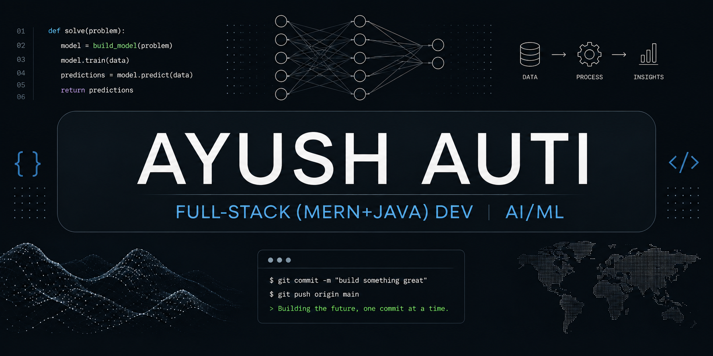

<h2>Hey there! I'm **Ayush**</h2>

### 👨🏻‍💻 &nbsp;About Me

💡 &nbsp;I'm a Full-stack developer with a strong interest in AI/ML .\
🎓 &nbsp;I'm currently studying **Bachelor's in Computer Engineering ** at **Dr D.Y Patil Institute of Technology,Pimpri**.

🌱 &nbsp;Currently going deeper into **Large Language Models, GenAI, Neural Networks  and Distributed Data Systems**.\
✍️ &nbsp;In my free time, I work on side projects, contribute to open source, and write about ML .\
💬 &nbsp;Feel free to reach out for collaborations, mentorship, or just an interesting tech discussion.\
✉️ &nbsp;You can email me at **ayushauti5605@gmail.com** - I'll get back to you as soon as I can.

### 🛠 &nbsp;Tech Stack

**Languages**\
&nbsp;
&nbsp;
&nbsp;
&nbsp;

**AI / ML**\
&nbsp;
&nbsp;
&nbsp;
&nbsp;
&nbsp;
&nbsp;
&nbsp;

**Web & Backend**\
&nbsp;
&nbsp;
&nbsp;
&nbsp;
&nbsp;
&nbsp;
&nbsp;

**Tools**\
&nbsp;
&nbsp;
&nbsp;
&nbsp;
&nbsp;

### 🤝🏻 &nbsp;Connect with Me

<a href="https://github.com/Ayush5605">

 

## 🏆 GitHub Trophies

<!--START_SECTION:waka-->

<!--END_SECTION:waka-->

style=flat&logo=GitHub&logoColor=white"/></a>

